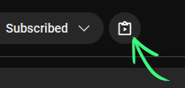

# Youtube to Clipboard

Firefox extension.

Adds a button to copy Youtube video information (title, URL, channel, date, length, etc) to the Windows clipboard as plain text.

See `signed` dir for .xpi, drag and drop onto Firefox to install.